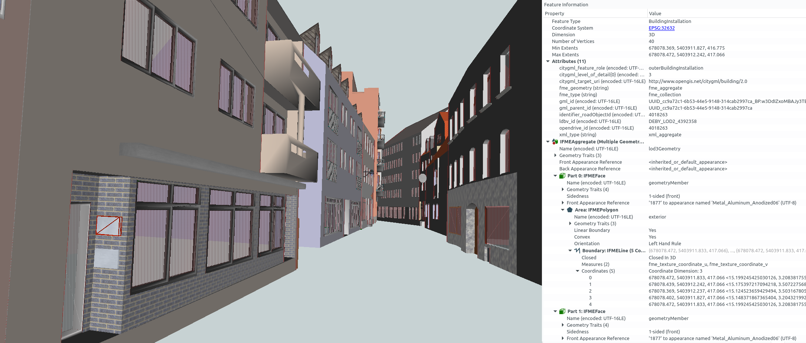
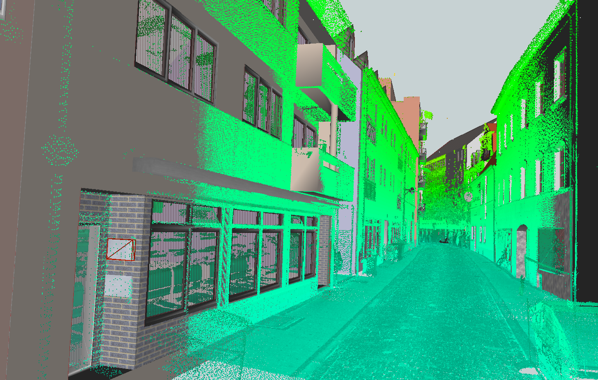
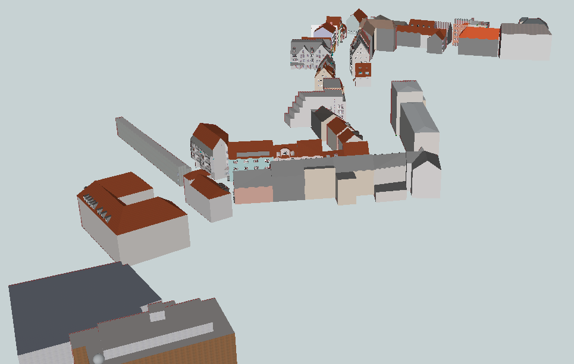
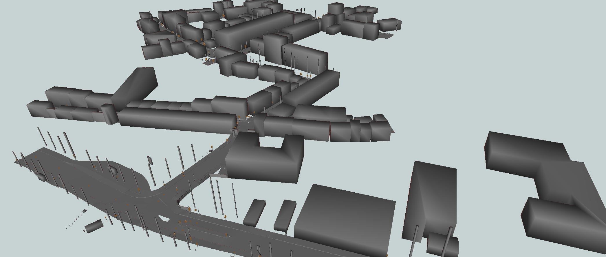

# :cityscape: LOD3 Road Space Models

This [CityGML](https://www.ogc.org/standards/citygml) dataset contains road space models (over 50 building models) in the area of [Ingolstadt](https://en.wikipedia.org/wiki/Ingolstadt).
To ensure the highest accuracy geometrically as well as semantically, the dataset was manually modeled based on the mobile laser scannings (MLS) provided by the company [3D Mapping Solutions GmbH](https://www.3d-mapping.de/en/) (relative accuracy in the range of 1-3cm).
Moreover, a complementary [OpenDRIVE](https://www.asam.net/standards/detail/opendrive/) dataset is available, which includes the road network, traffic lights, fences, vegetation and so on:

* :inbox_tray: CityGML & SketchUp
    * Download via the [releases section](https://github.com/savenow/lod3-road-space-models/releases)
    * Clone the repo: ```git clone --depth 1 git@github.com:savenow/lod3-road-space-models.git```
* :inbox_tray: OpenDRIVE
    * Download via the [website of 3D Mapping Solutions](https://www.3d-mapping.de/en/customer-area/demo-data/) (initial registration required)
    * Relevant OpenDRIVE dataset is named *Ingolstadt Innercity Halls* and can be found in the demo data area
    * Conversion to CityGML can be carried out using the tool [r:trån](https://rtron.io)

Further Information
* :earth_africa: Overview: [Web-Map-Client](https://www.3dcitydb.net/3dcitydb-web-map/1.6.1/3dwebclient/?title=Ingolstadt_CityGML_LoD3_Demo&shadows=false&terrainShadows=0&latitude=48.76421616414265&longitude=11.423261087465157&height=189.46220553536946&heading=170.97575939059712&pitch=-39.02715451772515&roll=0.03843163755915946&layer_0=url%3Dhttps%253A%252F%252Fwww.3dcitydb.net%252F3dcitydb%252Ffileadmin%252Fpublic%252F3dwebclientprojects%252Fingolstadt%252Fingolstadt_lod3%252Fkml_ingolstadt_trafficareas%252Fkml_ingolstadt_trafficareas_collada_MasterJSON.json%26name%3DIngolstadt_CityGML_TrafficArea%26active%3Dtrue%26spreadsheetUrl%3D%26cityobjectsJsonUrl%3D%26minLodPixels%3D0%26maxLodPixels%3D1.7976931348623157e%252B308%26maxSizeOfCachedTiles%3D200%26maxCountOfVisibleTiles%3D200&layer_1=url%3Dhttps%253A%252F%252Fwww.3dcitydb.net%252F3dcitydb%252Ffileadmin%252Fpublic%252F3dwebclientprojects%252Fingolstadt%252Fingolstadt_lod3%252Fkml_ingolstadt_auxiliarytrafficareas%252Fkml_ingolstadt_auxiliarytrafficareas_collada_MasterJSON.json%26name%3DIngolstadt_CityGML_AuxiliaryTrafficArea%26active%3Dtrue%26spreadsheetUrl%3D%26cityobjectsJsonUrl%3D%26minLodPixels%3D0%26maxLodPixels%3D1.7976931348623157e%252B308%26maxSizeOfCachedTiles%3D200%26maxCountOfVisibleTiles%3D200&layer_2=url%3Dhttps%253A%252F%252Fwww.3dcitydb.net%252F3dcitydb%252Ffileadmin%252Fpublic%252F3dwebclientprojects%252Fingolstadt_2%255Ckml_building_lod3_ingolstadt_neu%252Fkml_building_lod3_ingolstadt_collada_MasterJSON.json%26name%3DIngolstadt_CityGML_Building_LoD3%26active%3Dtrue%26spreadsheetUrl%3D%26cityobjectsJsonUrl%3D%26minLodPixels%3D0%26maxLodPixels%3D1.7976931348623157e%252B308%26maxSizeOfCachedTiles%3D200%26maxCountOfVisibleTiles%3D200&layer_3=url%3Dhttps%253A%252F%252Fwww.3dcitydb.net%252F3dcitydb%252Ffileadmin%252Fpublic%252F3dwebclientprojects%252Fingolstadt%252Fingolstadt_lod3%252Fkml_ingolstadt_sections%252Fkml_ingolstadt_sections_collada_MasterJSON.json%26name%3DIngolstadt_CityGML_Section%26active%3Dfalse%26spreadsheetUrl%3D%26cityobjectsJsonUrl%3D%26minLodPixels%3D0%26maxLodPixels%3D1.7976931348623157e%252B308%26maxSizeOfCachedTiles%3D200%26maxCountOfVisibleTiles%3D200&layer_4=url%3Dhttps%253A%252F%252Fwww.3dcitydb.net%252F3dcitydb%252Ffileadmin%252Fpublic%252F3dwebclientprojects%252Fingolstadt%252Fingolstadt_lod3%252Fkml_ingolstadt_intersection%252Fkml_ingolstadt_intersection_collada_MasterJSON.json%26name%3DIngolstadt_CityGML_Intersection%26active%3Dfalse%26spreadsheetUrl%3D%26cityobjectsJsonUrl%3D%26minLodPixels%3D0%26maxLodPixels%3D1.7976931348623157e%252B308%26maxSizeOfCachedTiles%3D200%26maxCountOfVisibleTiles%3D200) (LoD3 models combined with converted OpenDRIVE dataset)
* :eyeglasses: Creation guideline: [Creating LOD3 Models Based on Point Clouds](https://creating-citygml-datasets.readthedocs.io/en/latest/creation-guidelines/lod3-models-based-on-point-clouds.html)
* :page_facing_up: License: [CC BY-SA 4.0](LICENSE)

<p float="center">
    
    
    
    
</p>

## :incoming_envelope: Feedback & Contributions

This dataset is under active development.
To expand and improve the dataset, [feedback and contributions](https://github.com/savenow/lod3-road-space-models/issues) are always appreciated.
Thus, the SketchUp project files are also provided along with [creation guidelines](https://creating-citygml-datasets.readthedocs.io/en/latest/creation-guidelines/lod3-models-based-on-point-clouds.html).
You can also contact me directly via mail [benedikt.schwab@tum.de](mailto:benedikt.schwab@tum.de?subject=[GitHub]%20LoD3%20Road%20Space%20Models).

## :handshake: Thanks

Very special acknowledgments are due to [Sophie Haas Goschenhofer](https://github.com/Sophie876) and [Olaf Wysocki](https://github.com/OloOcki), who worked diligently on the development of the methodology and the realization of the modeling.
